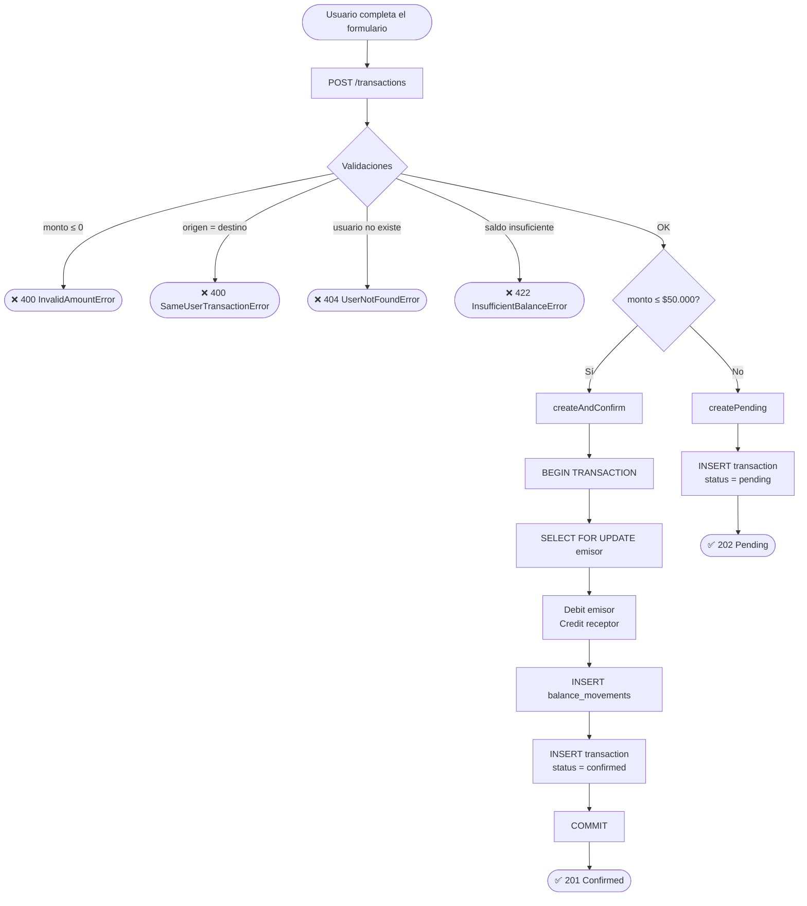
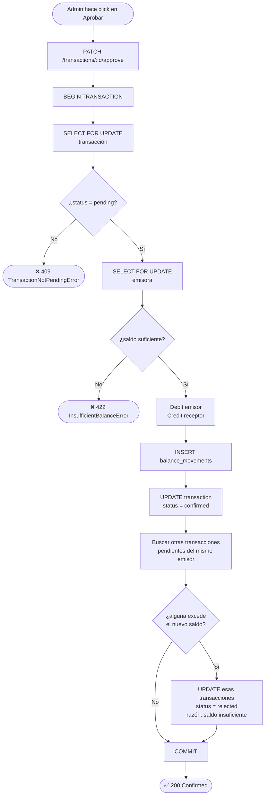
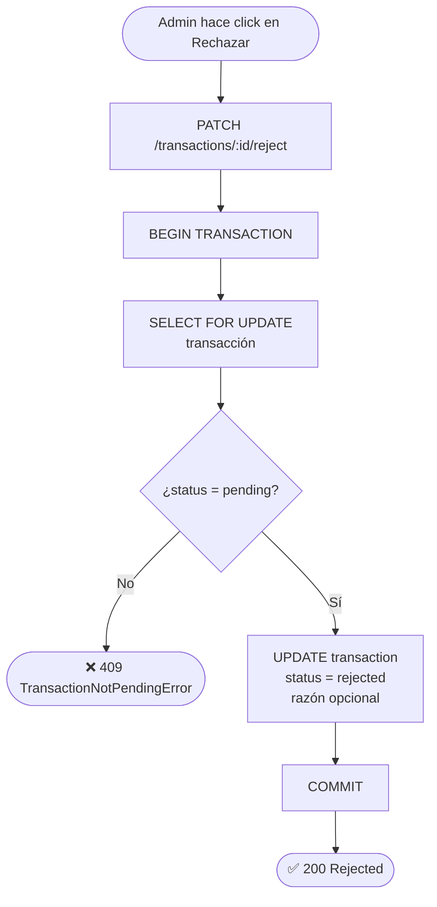
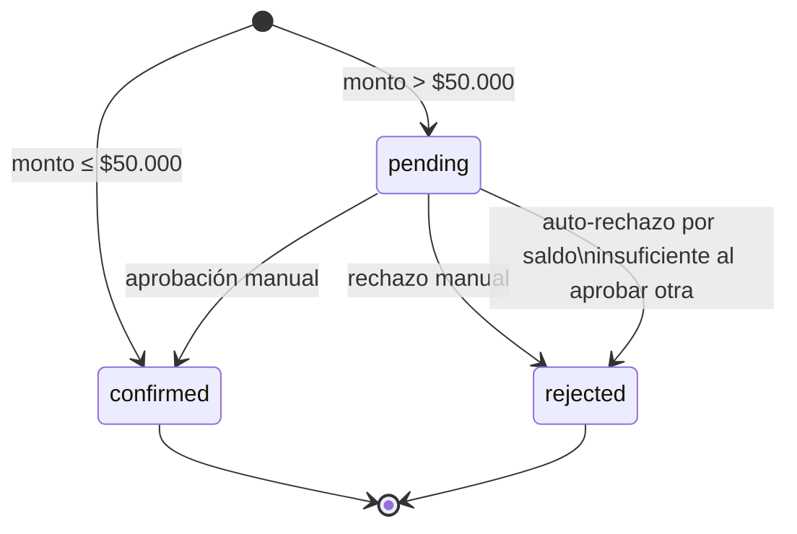

# Flujos del sistema

## 1. Crear transacción

El monto determina si la transacción se confirma en el momento o queda pendiente de aprobación.

---

## 2. Aprobar transacción

El balance **no fue reservado** al crear la transacción pendiente, por lo que la aprobación incluye una verificación de saldo en el momento.

---

## 3. Rechazar transacción

Flujo simple: no mueve fondos, solo actualiza el estado.

---

## 4. Ciclo de vida de una transacción

